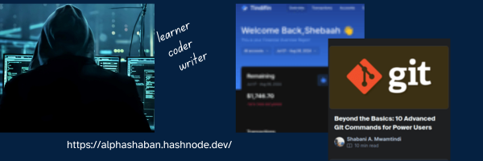

## Hi there 👋

+ 🔭 I’m currently working on something cool.
+ 🌱 I’m currently developing a banking and hospital management system.
+ 👯 I’m looking to collaborate with anyone ; come with any idea buddy.
+ 💬 Ask me about cybersec and webdev.
```
class CyberSecWebDev:
    def __init__(self, name):
        self.name = name

    def secure_website(self):
        print(f"{self.name} is coding a website...")
        print("Oops, forgot to sanitize inputs! Fixing now...")

    def deploy_website(self):
        print("Deploying website securely...")
        print("Firewall: Up. SSL: Check. Vulnerabilities: 0... for now!")

me = CyberSecWebDev("Shabani")
me.secure_website()
me.deploy_website()
```
## 📫 How to reach me:
- [Email](mwamtindishaban@gmail.com)
- [Twitter](https://twitter.com/Mwamtindi_jnr)
- [LinkedIn](https://www.linkedin.com/in/shabani-mwamtindi/)

<!--
**Mwamtindi/Mwamtindi** is a ✨ _special_ ✨ repository because its `README.md` (this file) appears on your GitHub profile.

Here are some ideas to get you started:

- 🔭 I’m currently working on ...
- 🌱 I’m currently learning ...
- 👯 I’m looking to collaborate on ...
- 🤔 I’m looking for help with ...
- 💬 Ask me about ...
- 📫 How to reach me: ...
- 😄 Pronouns: ...
- ⚡ Fun fact: ...
-->
